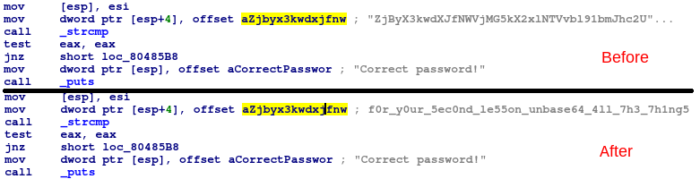
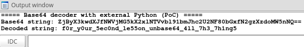

# External Python Base64 decoder

Proof of Concept

My blog post about [Executing external programs from IDA](https://malwarelab.eu/posts/idc-python/)

## Features
* simple IDC script for decoding Base64-encoded strings
* proof of concept for running external programs/commands and get their output back to the IDA
* uses external python command interpreter for base64 decoding
	* if you want to see pure-idc implementation of Base64 decoding, just check the implementation in my [Snatch ransomware strings decryptor](https://github.com/laciKE/snatch_string_decryptor)
* **IDA Freeware supported**
	* yes, this PoC shows how we can execute **external Python from IDC** even in IDA Freeware

## Installation and usage

* add python executable to your path
* place the cursor either on base64-encoded string or on instruction with xref to that string
* run the 'python_base64_decoder.idc' file in IDA with **File->Script File**
